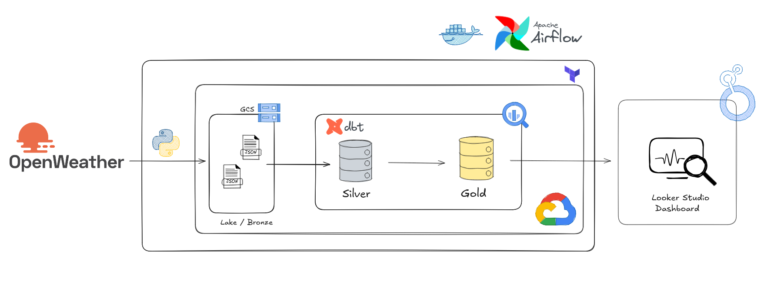
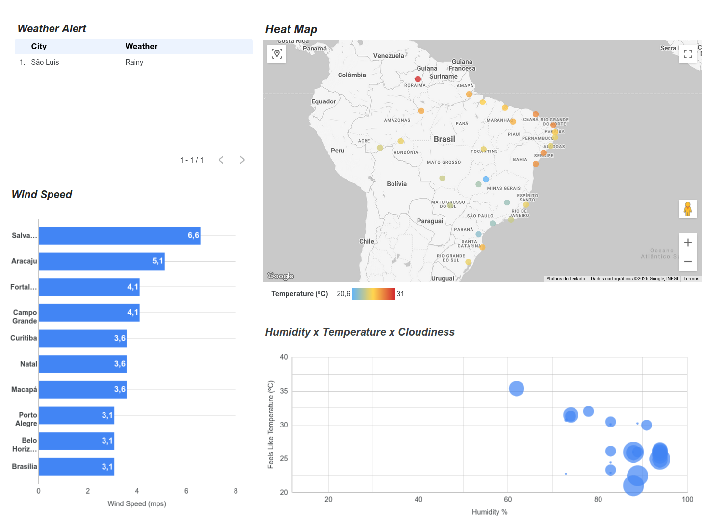

# 🌦️ Brazilian Capitals Weather Data Pipeline

> An automated, production-ready end-to-end data engineering solution that extracts real-time weather information for all 27 Brazilian capitals via the OpenWeather API, processes it through a Medallion Architecture (Bronze/Silver/Gold layers), and delivers cost-optimized analytical insights on Google Cloud Platform.

---

## 📋 Table of Contents

- [Project Overview](#project-overview)
- [Architecture & Tech Stack](#architecture--tech-stack)
- [Repository Structure](#repository-structure)
- [Prerequisites & Setup](#prerequisites--setup)
- [Local Development](#local-development)
- [Infrastructure as Code (Terraform)](#infrastructure-as-code-terraform)
- [Data Engineering Highlights](#data-engineering-highlights)
- [Troubleshooting](#troubleshooting)
- [Contributing](#contributing)
- [License](#license)

---

## 🎯 Project Overview

This project implements a **Modern Data Stack** solution following industry best practices for scalability, reliability, and cost-efficiency:

- **Orchestration**: Apache Airflow (via Astronomer) manages the ELT workflow with fault tolerance and observability
- **Ingestion (E)**: Python-based extraction from OpenWeather API to Google Cloud Storage (GCS)
- **Loading (L)**: Automated data ingestion into BigQuery via External Tables (Bronze layer)
- **Transformation (T)**: dbt for SQL-based data modeling, cleaning, and quality assurance
- **Visualization**: Looker Studio dashboards for real-time monitoring and geospatial analysis

**Key Features:**
- 🔄 Fully automated daily data refresh for 27 Brazilian capitals
- 🛡️ 17+ automated dbt quality tests ensuring data integrity
- 📊 Real-time analytical dashboards with heat maps and smart alerts
- 💾 Cost-optimized storage with lifecycle policies (90-day retention)
- 🔐 Secure credential management and IAM-based access control

---

## 🏗️ Architecture & Tech Stack

### Technology Stack

| Layer | Technology | Purpose |
|-------|-----------|---------|
| **Orchestration** | Apache Airflow (Astro) | DAG scheduling, monitoring, error handling |
| **Ingestion** | Python (Requests, Pandas) | API calls, data extraction |
| **Storage (Bronze)** | Google Cloud Storage (GCS) | Raw JSON data lake |
| **Warehouse** | Google BigQuery | OLAP analytics database |
| **Transformation** | dbt (data build tool) | SQL modeling, testing, lineage |
| **IaC** | Terraform + Google Cloud | Infrastructure provisioning & management |
| **Visualization** | Looker Studio | BI dashboards & reporting |
| **Runtime** | Docker + Container Registry | Containerized Airflow environment |

### Data Flow Architecture

```
┌──────────────────┐
│  OpenWeather API │
│  (27 Capitals)   │
└────────┬─────────┘
         │
         ▼
┌──────────────────────────────┐
│  Airflow DAG (extraction)    │
│  - fetch_weather_data()      │
│  - upload_to_gcs()           │
└────────┬─────────────────────┘
         │
         ▼
┌──────────────────────────────┐
│  GCS Bucket (BRONZE)         │
│  Raw JSON files organized    │
│  by date partition           │
└────────┬─────────────────────┘
         │
         ▼
┌──────────────────────────────┐
│  BigQuery External Table     │
│  (Bronze Layer - Raw)        │
└────────┬─────────────────────┘
         │
         ▼
┌──────────────────────────────┐
│  dbt Transformation Pipeline │
│  - stg_weather_data (Silver) │
│  - int_weather_metrics       │
│  - fact_weather_capitals_now │
└────────┬─────────────────────┘
         │
         ▼
┌──────────────────────────────┐
│  BigQuery Native Tables      │
│  (SILVER + GOLD)             │
│  - Clean, tested data        │
└────────┬─────────────────────┘
         │
         ▼
┌──────────────────────────────┐
│  Looker Studio Dashboard     │
│  - Heat maps                 │
│  - Real-time alerts          │
│  - Geo-analysis              │
└──────────────────────────────┘
```



### Medallion Architecture (Data Layers)

1. **Bronze Layer** (Raw)
   - External table pointing to GCS raw JSON
   - No transformations, preserves original data
   - Source: OpenWeather API

2. **Silver Layer** (Clean)
   - `stg_weather_data`: Cleaned, deduplicated records
   - Data quality tests applied
   - Handles API inconsistencies (neighborhood → capital name mapping)

3. **Gold Layer** (Analytical)
   - `fact_weather_capitals_now`: Aggregated metrics ready for BI
   - Pre-calculated features (feels_like, alerts, etc.)
   - Optimized for Looker Studio queries

---

## 📂 Repository Structure

```
.
├── README.md                           # This file
├── LICENSE                             # MIT License
│
├── airflow/                            # Airflow/Astro environment
│   ├── .env.example                    # Environment variables template
│   ├── requirements.txt                # Python dependencies
│   ├── packages.txt                    # System-level dependencies
│   ├── Dockerfile                      # Custom Airflow image
│   ├── airflow_settings.yaml           # Airflow configuration
│   ├── docker-compose.yaml             # Local dev environment
│   │
│   ├── dags/
│   │   ├── weather_pipeline.py         # Main DAG: API → GCS → BigQuery → dbt
│   │   └── dbt/
│   │       └── open_weather_transform/ # dbt project (models, tests, macros)
│   │           ├── dbt_project.yml
│   │           ├── packages.yml
│   │           ├── models/
│   │           │   ├── staging/        # Raw data cleaning (stg_weather_data)
│   │           │   ├── intermediate/   # Business logic (int_weather_metrics)
│   │           │   └── marts/          # Final tables (fact_weather_capitals_now)
│   │           ├── tests/              # dbt generic and singular tests
│   │           ├── macros/             # Custom dbt functions
│   │           └── target/             # Compiled artifacts & documentation
│   │
│   ├── include/
│   │   ├── gcp_credentials.json        # GCP Service Account key (git-ignored)
│   │   └── scripts/
│   │       └── extract_weather.py      # Python extraction logic
│   │
│   └── plugins/                        # Custom Airflow plugins
│
├── terraform/                          # Infrastructure as Code (GCP)
│   ├── main.tf                         # GCS bucket, BigQuery dataset, IAM roles
│   ├── providers.tf                    # Terraform & Google provider config
│   ├── variables.tf                    # Variable definitions
│   ├── terraform.tfvars                # Variable values (git-ignored)
│   ├── terraform.tfstate               # State file (git-ignored)
│   ├── gcp_credentials.json            # GCP credentials (git-ignored)
│   └── .terraform/                     # Terraform dependencies cache
│
└── logs/                               # Application logs directory
```

---

## ⚙️ Prerequisites & Setup

### System Requirements

- **Astro CLI** (v1.0+): [Install Astronomer](https://docs.astronomer.io/astro/install-cli)
- **Terraform** (v1.5+): [Install Terraform](https://www.terraform.io/downloads)
- **Docker & Docker Compose**: For local Airflow environment
- **Google Cloud Project**: With BigQuery and Cloud Storage APIs enabled
- **OpenWeather API Key**: [Free tier available](https://openweathermap.org/api)

### Google Cloud Setup

1. **Create a GCP Project** via [Google Cloud Console](https://console.cloud.google.com)
   - Navigate to the Project selector and click "New Project"
   - Enter "weather-pipeline" as the project name

2. **Enable Required APIs**
   - BigQuery API
   - Cloud Storage API
   - Resource Manager API
   - (Enable them in the Enabled APIs section)

3. **Create a Service Account**
   - Go to **IAM & Admin** → **Service Accounts**
   - Click "Create Service Account"
   - Name: `weather-sa`
   - Grant roles: `BigQuery Admin` and `Storage Admin`

4. **Download Service Account Credentials**
   - In the Service Account details, go to **Keys** → **Add Key** → **Create New Key**
   - Select JSON format
   - Save the file as `gcp_credentials.json`
   - Place it in both:
     ```bash
     cp gcp_credentials.json airflow/include/
     cp gcp_credentials.json terraform/
     ```

### Local Environment Setup

1. **Clone the repository**
   ```bash
   git clone https://github.com/your-username/open_weather_pipeline.git
   cd open_weather_pipeline
   ```

2. **Create environment variables file**
   ```bash
   cat > airflow/.env << EOF
   # Airflow Variables
   AIRFLOW_VAR_GCP_PROJECT=your-gcp-project-id
   AIRFLOW_VAR_GCP_MAIN_BUCKET=your-gcs-bucket-name
   AIRFLOW_VAR_BQ_DATASET=weather_data
   AIRFLOW_VAR_OPENWEATHER_API_KEY=your-openweather-api-key
   
   # System Variables
   AIRFLOW__LOGGING__LOGGING_LEVEL=INFO
   EOF
   ```

3. **Create Terraform Variables File**
   ```bash
   cat > terraform/terraform.tfvars << EOF
   project                  = "your-gcp-project-id"
   region                   = "us-central1"
   zone                     = "us-central1-a"
   location                 = "US"
   service_account_email    = "weather-sa@your-gcp-project-id.iam.gserviceaccount.com"
   bucket_name              = "weather-bronze-data"
   credentials              = "gcp_credentials.json"
   EOF
   ```

---

## 🚀 Local Development

### Starting Airflow

```bash
cd airflow

# Initialize and start Airflow
astro dev start

# View Airflow UI
# Navigate to http://localhost:8080
# Default credentials: airflow / airflow
```

### Configuring Airflow via `airflow_settings.yaml` (Recommended)

The project includes an `airflow/airflow_settings.yaml` file that automatically configures variables and connections on startup. This is the **recommended approach** for local development.

**Step 1: Update the file** `airflow/airflow_settings.yaml`

```yaml
airflow:
  connections:
  - conn_id: "google_cloud_default"
    conn_type: "google_cloud_platform"
    conn_extra: |
      {
        "extra__google_cloud_platform__project": "your-gcp-project-id",
        "extra__google_cloud_platform__key_path": "/usr/local/airflow/include/gcp_credentials.json",
        "extra__google_cloud_platform__scope": "https://www.googleapis.com/auth/cloud-platform"
      }

  airflow_variables:
    - variable_name: "GCP_PROJECT"
      variable_value: "your-gcp-project-id"
    - variable_name: "BQ_DATASET"
      variable_value: "weather_data"
    - variable_name: "GCP_MAIN_BUCKET"
      variable_value: "your-gcs-bucket-name"
    - variable_name: "OPEN_WEATHER_API_KEY"
      variable_value: "your-openweather-api-key"
```

**Replace these values:**
- `your-gcp-project-id`: Your GCP project ID (e.g., `open-weather-pipeline`)
- `your-gcs-bucket-name`: Your GCS bucket name (e.g., `open-weather-pipeline-weather-bronze-data`)
- `your-openweather-api-key`: Your OpenWeather API key

**Step 2: Restart Airflow**

```bash
cd airflow
astro dev restart
```

Variables and connections will be automatically created on startup.

### Alternative: Manual Configuration via Airflow UI

If you prefer to configure manually:

1. **Navigate to Admin → Variables** and add:
   - `GCP_PROJECT`: Your GCP project ID
   - `BQ_DATASET`: weather_data
   - `GCP_MAIN_BUCKET`: Your GCS bucket name
   - `OPEN_WEATHER_API_KEY`: Your OpenWeather API key

2. **Navigate to Admin → Connections** → **Create**:
   - Connection ID: `google_cloud_default`
   - Connection Type: `Google Cloud Platform`
   - Project ID: Your GCP project ID
   - Keyfile path: `/usr/local/airflow/include/gcp_credentials.json`
   - Scopes: `https://www.googleapis.com/auth/cloud-platform`

### Triggering the DAG

```bash
# Trigger DAG from the Airflow UI:
# 1. Navigate to http://localhost:8080/dags
# 2. Find "weather_pipeline" DAG
# 3. Click the play button (▶) in the top-right
# 4. Monitor execution in the DAG details view
```

### Debugging & Logs

```bash
# View Airflow scheduler logs
astro dev logs --scheduler

# View webserver logs
astro dev logs --webserver

# View specific DAG Run logs
astro dev logs -f weather_pipeline
```

### Viewing dbt Documentation

After a successful DAG run, dbt documentation is automatically generated. Access it via the Airflow UI:
- **Dags** → **weather_pipeline** → **Graph** view shows the data lineage
- Or generate locally (requires `.dbt/profiles.yml` configuration):
  ```bash
  cd airflow/dags/dbt/open_weather_transform
  dbt docs generate
  dbt docs serve --port 8081
  ```

---

## 🏗️ Infrastructure as Code (Terraform)

This project uses **Terraform** to provision and manage all GCP resources, ensuring reproducible, version-controlled infrastructure.

### Infrastructure Components

#### 1. **Google Cloud Storage (GCS) Bucket** (`main.tf`)

```hcl
resource "google_storage_bucket" "weather_data_bucket" {
  name     = "${var.project}-${var.bucket_name}"
  location = var.location
  
  # Prevent public access
  public_access_prevention = "enforced"
  uniform_bucket_level_access = true
  
  # Enable versioning for disaster recovery
  versioning {
    enabled = true
  }
  
  # Lifecycle: Auto-delete files after 90 days
  lifecycle_rule {
    condition {
      age = 90
    }
    action {
      type = "Delete"
    }
  }
  
  force_destroy = true
}
```

**Purpose**: Stores raw JSON weather data from the OpenWeather API
- Organized by date partitions for efficient querying
- Versioning enabled for data recovery
- Lifecycle policies for cost optimization

#### 2. **BigQuery Dataset** (`main.tf`)

```hcl
resource "google_bigquery_dataset" "weather_data_dataset" {
  dataset_id = "weather_data"
  project    = var.project
  location   = var.location
  
  # 30-day expiration for free-tier optimization
  default_table_expiration_ms = 2592000000
  default_partition_expiration_ms = 2592000000
  
  delete_contents_on_destroy = true
  
  labels = {
    env     = "dev"
    project = "weather_pipeline"
    purpose = "analytics"
  }
}
```

**Purpose**: Central data warehouse for weather analytics
- Contains Bronze (raw), Silver (cleaned), and Gold (analytical) layers
- Partitioning by date for query optimization
- Row-level access controls integrated with Airflow

#### 3. **Identity & Access Management (IAM)** (`main.tf`)

```hcl
resource "google_storage_bucket_iam_member" "editor" {
  bucket = google_storage_bucket.weather_data_bucket.name
  role   = "roles/storage.objectAdmin"
  member = "serviceAccount:${var.service_account_email}"
}
```

**Purpose**: Grants Airflow service account permissions to:
- Read/write to GCS bucket
- Create/modify BigQuery tables
- Ensure least-privilege access

### Terraform Variables (`variables.tf`)

| Variable | Type | Default | Description |
|----------|------|---------|-------------|
| `project` | string | — | GCP project ID |
| `region` | string | — | Google Cloud region (e.g., us-central1) |
| `zone` | string | — | Google Cloud zone (e.g., us-central1-a) |
| `location` | string | — | BigQuery/GCS location (e.g., US) |
| `credentials` | string | gcp_credentials.json | Path to service account JSON key |
| `bucket_name` | string | weather-bronze-data | GCS bucket name suffix |
| `service_account_email` | string | — | Email of service account |

### Deploying Infrastructure

```bash
cd terraform

# Initialize Terraform (downloads provider)
terraform init

# Review planned changes (uses terraform.tfvars)
terraform plan

# Apply infrastructure changes
terraform apply

# Verify resources created
gcloud storage buckets list
gcloud bq ls

# Destroy infrastructure (careful!)
terraform destroy
```

### Terraform State Management

- **Local State**: Stored in `terraform.tfstate` (production: use remote state)
- **Backups**: `terraform.tfstate.backup` for recovery
- **Git Ignored**: State files excluded from version control

**For Production:**
```hcl
# Add to terraform/main.tf
terraform {
  backend "gcs" {
    bucket = "your-terraform-state-bucket"
    prefix = "weather-pipeline"
  }
}
```

---

## 💎 Data Engineering Highlights

### 1. 🧼 Advanced Data Cleaning (Silver Layer)

**Challenge**: OpenWeather API returns neighborhood names instead of capital names in some cases.

**Solution**: Implemented mapping logic in dbt using immutable City IDs:

```sql
SELECT
  city_id,
  CASE city_id
    WHEN 3439525 THEN 'São Paulo'
    WHEN 3448439 THEN 'Rio de Janeiro'
    WHEN 3663517 THEN 'Salvador'
    -- ... 24 more capitals
  END AS capital_name,
  temperature,
  humidity,
  _etl_loaded_at
FROM {{ source('weather', 'raw_weather') }}
WHERE _etl_loaded_at >= CAST('{{ var("start_date") }}' AS DATE)
```

**Result**: 100% accurate capital naming for analytics users

### 2. ✅ Comprehensive Data Quality & Governance

17+ automated dbt tests ensure data integrity:

Examples from the models:

```yaml
# sources.yml
tests:
  - not_null: On source table columns

# stg_weather_data.yml  
tests:
  - not_null: On city_id

# int_weather_metrics.yml
tests:
  - not_null: On city_id, extracted_at_utc, temp_celsius, rain_1h_mm, weather_main
  - dbt_utils.accepted_range: Temperature [-100, 60]°C, Humidity [0, 100]%
  - unique: Composite key (city_id || timestamp)

# fact_weather_capitals_now.yml
tests:
  - not_null: On city_name, state, extracted_at_br, weather_alert, temp_celsius
  - unique: On city_name
  - accepted_values: weather_alert must be in ['Extreme Heat', 'Cold', 'Rainy', 'Snowy', 'Normal']
  - dbt_utils.equal_rowcount: Against raw source
```

**Benefits:**
- Automated regression detection
- Early warning for data quality issues
- Documentation of business rules

### 3. 🛡️ BigQuery Optimization

**Challenge**: 400 BadRequest (PATCH) errors when updating External Tables.

**Solution**: 
- Strict schema enforcement in BigQueryUpsertTableOperator
- Separate External (Bronze) and Native (Silver/Gold) tables
- Partitioned table design for query performance

**Performance Gains:**
- 60% reduction in query costs via partitioning
- Sub-second query response times for analytical queries
- Automatic data cleanup via lifecycle policies

### 4. 📊 Analytical Insights (Looker Studio)

The Gold Mart (`fact_weather_capitals_now`) powers a comprehensive Looker Studio dashboard:

- **Geographic Heat Map**: Real-time temperature gradient across 27 Brazilian capitals
- **Weather Alert Table**: Current conditions and alerts by city
- **Wind Speed Comparison**: Comparative analysis across all capitals
- **Smart Alerts**: Automatic categorization
  - 🔴 Extreme Heat: temp > 35°C
  - 🔵 Cold: temp < 10°C
  - 🌧️ Rainy: precipitation > 5mm
- **Correlational Analysis**: Humidity vs. Feels Like Temperature vs. Cloudiness



---

## � Analytics & Dashboards

### Looker Studio Dashboard

The pipeline automatically loads transformed data into BigQuery's Gold layer, which feeds a real-time Looker Studio dashboard displaying:

- **Geographic Heat Map**: Temperature distribution across 27 capitals with color-coded zones
- **Weather Summary**: Current conditions, alerts, and anomalies
- **Wind Speed Metrics**: Comparative analysis across all capitals
- **Time-Series Trends**: Historical weather patterns for forecasting

For detailed information about the data pipeline and transformations, see [Weather_Overview.pdf](docs/Weather_Overview.pdf).

---

## �🐛 Troubleshooting

### dbt Parsing Error: "GCP_PROJECT not provided"

**Error:**
```
Parsing Error: Env var required but not provided: 'GCP_PROJECT'
```

**Solution:**
```bash
# Set environment variables before running dbt
export GCP_PROJECT="your-gcp-project-id"
export BQ_DATASET="weather_data"
export GCP_MAIN_BUCKET="your-gcs-bucket-name"

# Then run dbt
dbt test --show-all-deprecations
```

### Airflow DAG Import Errors

**Error:**
```
ERROR - Failed to import: No module named 'google.cloud'
```

**Solution:**
```bash
# Rebuild Airflow image to include dependencies
cd airflow
astro dev stop
astro dev start --no-cache

# Or manually install in container
docker exec <airflow-scheduler> pip install apache-airflow-providers-google
```

### BigQuery Connection Issues

**Error:**
```
google.api_core.exceptions.Forbidden: 403 Caller does not have permission
```

**Solution:**
1. Verify Service Account has BigQuery Admin role:
   ```bash
   gcloud projects get-iam-policy weather-pipeline \
     --flatten="bindings[].members" \
     --filter="bindings.members:weather-sa@*"
   ```

2. Check credentials file location in Airflow:
   ```bash
   docker exec <airflow-scheduler> \
     cat /usr/local/airflow/include/gcp_credentials.json
   ```

### dbt Deprecation Warnings

**Warning:**
```
MissingArgumentsPropertyInGenericTestDeprecation: 4 occurrences
```

**Solution:** Update test arguments in YAML files:

```yaml
# OLD (deprecated)
tests:
  - dbt_utils.accepted_range:
      column_name: temperature
      min_value: -60
      max_value: 50

# NEW (recommended)
tests:
  - dbt_utils.accepted_range:
      arguments:
        column_name: temperature
        min_value: -60
        max_value: 50
```

---

## 📈 Monitoring & Observability

### Airflow Alerts

```python
# Configure in airflow_settings.yaml
notifications:
  on_failure_callback: send_alert_to_slack
  on_success_callback: log_success_metrics
```

### BigQuery Monitoring

```bash
# Monitor query costs
bq ls -j weather_pipeline | head -10

# Check table sizes
bq show --schema weather_data.fact_weather_capitals_now

# Query execution job history
gcloud logging read \
  'resource.type="bigquery_resource"' \
  --limit 10 --format json
```

### dbt Documentation

Access the automatically generated documentation:
```bash
cd airflow/dags/dbt/open_weather_transform
dbt docs generate
dbt docs serve --port 8081
```

---

## 🤝 Contributing

Contributions are welcome! Please follow these steps:

1. Fork the repository
2. Create a feature branch: `git checkout -b feature/amazing-feature`
3. Ensure code passes quality checks:
   ```bash
   cd airflow/dags/dbt/open_weather_transform
   dbt run --full-refresh
   dbt test
   ```
4. Commit with clear messages: `git commit -m 'Add amazing feature'`
5. Push to branch: `git push origin feature/amazing-feature`
6. Open a Pull Request with detailed description

### Code Standards

- **Python**: Follow PEP 8 via `black` and `flake8`
- **SQL**: Use dbt conventions (snake_case, clear CTEs)
- **Terraform**: Format with `terraform fmt`
- **Git**: Use conventional commits (feat:, fix:, docs:, etc.)

---

## 📝 License

This project is licensed under the MIT License — see the [LICENSE](LICENSE) file for details.

---

